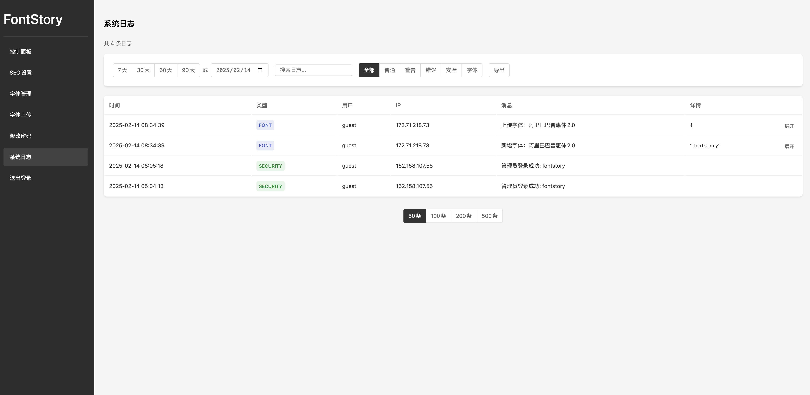
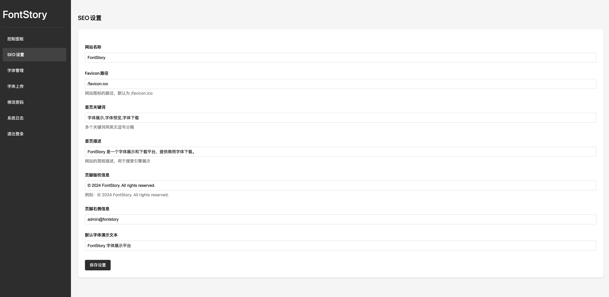
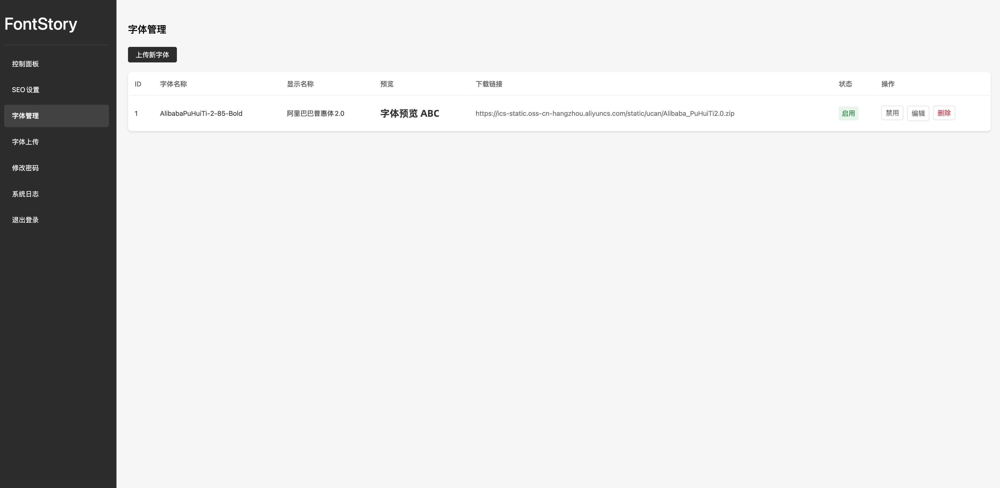
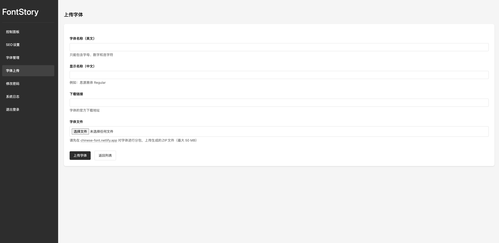
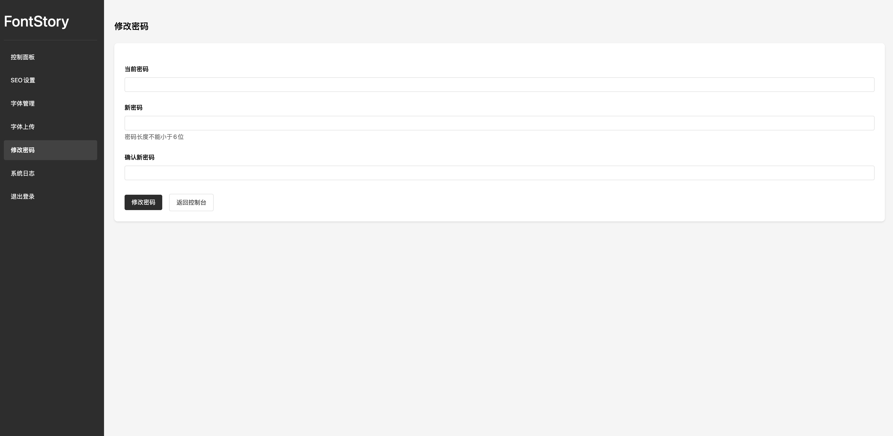
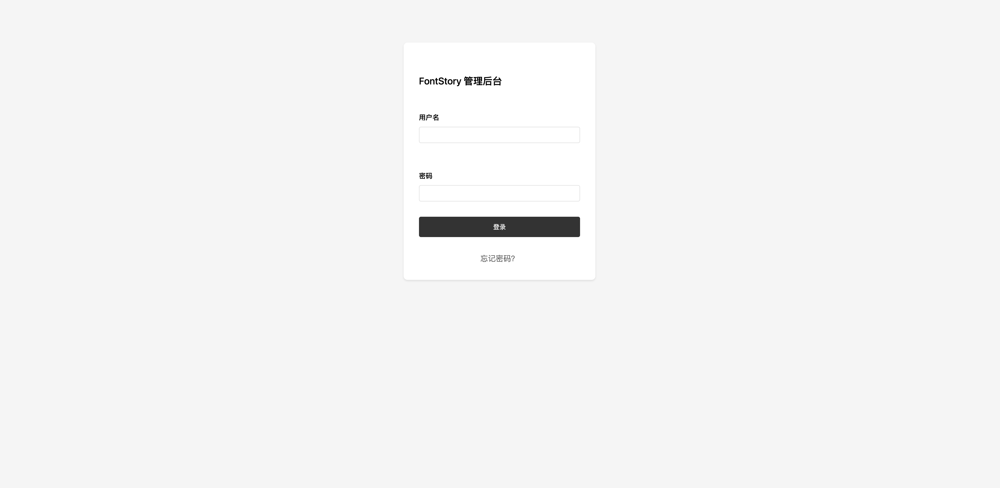

# FontStory
一个字体展示和管理平台，支持字体在线预览、分包上传、后台管理等功能。

## 界面预览









## 特性
- 🎨 支持字体在线预览和动态调整大小
- 📱 响应式设计，完美适配移动端
- 🌓 深色/浅色主题无缝切换
- ⚡️ 字体分包加载，极速浏览体验
- 🔒 完整的后台管理系统
- 📊 详细的系统日志记录
- 🛠 SEO 优化设置支持

## 安装部署

### 系统要求
- PHP 7.4+
- SQLite 3
- Nginx 1.22+ / Apache
- 写入权限：database/, fonts/, logs/

### 推荐环境
- 宝塔面板
- PHP 7.4.33
- Nginx 1.22.1

### 安装步骤
1. 上传文件到网站目录

2. 设置目录权限
```bash
chmod -R 755 .
chmod -R 777 database fonts logs
```

3. 初始化数据库
- 访问 admin/init_db.php 进行初始化

4. 登录后台
- 地址：admin/login.php
- 默认账号：fontstory
- 默认密码：fontstory123

## 使用说明

### 字体上传
1. 登录后台管理系统
2. 进入字体管理页面
3. 选择字体文件上传
4. 系统自动生成预览

### 主题切换
- 点击页面右上角的主题切换按钮
- 支持深色和浅色两种主题
- 用户偏好自动保存

### 字体预览
- 在首页输入自定义文本
- 实时预览不同字体效果
- 支持字体大小动态调整

## 技术栈
- **前端**：HTML5, CSS3, JavaScript (ES6+)
- **后端**：PHP 7.4+
- **数据库**：SQLite 3
- **服务器**：Nginx/Apache

## 目录结构
```
FontStory/
├── admin/              # 后台管理系统
│   ├── login.php      # 登录页面
│   ├── dashboard.php  # 控制台
│   ├── fonts.php      # 字体管理
│   ├── upload.php     # 文件上传
│   └── ...
├── css/               # 样式文件
│   └── styles.css
├── js/                # JavaScript文件
│   └── main.js
├── includes/          # 核心文件
│   ├── config.php     # 配置文件
│   ├── db.php         # 数据库连接
│   └── functions.php  # 公共函数
├── fonts/             # 字体文件存储
├── database/          # SQLite数据库
├── logs/              # 系统日志
├── ui_screenshots/    # 界面截图
└── index.php          # 首页
```

## 支持页面


## 许可证
本项目采用 MIT 许可证。详情请参阅 LICENSE 文件。

## 贡献
欢迎提交 Issue 和 Pull Request 来改进这个项目。

## 联系方式
如有问题或建议，请通过以下方式联系：
- 项目地址：https://github.com/Racsocc/FontStory
- 邮箱：racso.g.vip@gmail.com