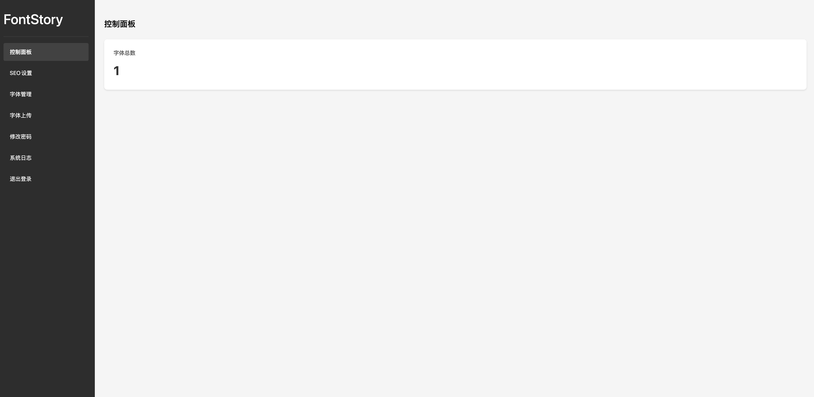
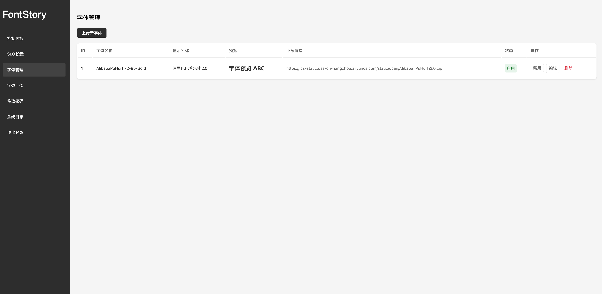

# FontStory
一个字体展示和管理平台，支持字体在线预览、分包上传、后台管理等功能。

## 界面预览





## 特性
- 🎨 支持字体在线预览和动态调整大小
- 📱 响应式设计，完美适配移动端
- 🌓 深色/浅色主题无缝切换
- ⚡️ 字体分包加载，极速浏览体验
- 🔒 完整的后台管理系统
- 📊 详细的系统日志记录
- 🛠 SEO 优化设置支持

## 安装部署

### 系统要求
- PHP 7.4+
- SQLite 3
- Nginx 1.22+ / Apache
- 写入权限：database/, fonts/, logs/

### 推荐环境
- 宝塔面板
- PHP 7.4.33
- Nginx 1.22.1

### 安装步骤
1. 上传文件到网站目录

2. 设置目录权限
```bash
chmod -R 755 .
chmod -R 777 database fonts logs
```

3. 初始化数据库
- 访问 admin/init_db.php 进行初始化、

4. 登录后台
- 地址：admin/login.php
- 默认账号：fontstory
- 默认密码：fontstory


> ⚠️ **重要安全提示**：
> 
> 🔒 **1. 初始化完成后，请立即删除或重命名 init_db.php 文件，**
>    **以防止数据库被他人重复初始化**
> 
> 🔑 **2. 登录后台后，请立即修改默认密码**

5. 点击字体上传，填写字体信息，上传分包字体zip，发布即可。

### 常见问题
1. 文件上传失败
- 检查 PHP upload_max_filesize
- 检查 Nginx client_max_body_size

2. 数据库错误
- 确保 database/ 目录可写
- 检查 SQLite 扩展是否启用

## 感谢名单

1. 字体分包工具：[chinese-font.netlify.app](https://chinese-font.netlify.app/zh-cn/online-split/) ，本项目字体分包功能依赖此工具实现；
  
2. 特别感谢：樵夫 提供字体分包项目线索；
3. 本项目全程使用Cursor IDE开发，项目中90%代码由的 claude-3.5-sonnet 编写，虽然花了钱，如果没有AI工具的辅助，我想以现在的能力，我可能需要耗费很多时间成本才能完成。而在AI的辅助下，这个项目总开发时长仅用了2天。


## 许可证
[](https://www.gnu.org/licenses/gpl-3.0)

本项目采用 GNU General Public License v3.0 (GPL-3.0) 开源许可证:

- 禁止闭源：任何基于本项目的衍生作品必须以相同的许可证开源
- 保留署名：必须保留原作者署名和版权信息
- 非商业用途：仅供个人学习和非商业用途使用
- 传染性：修改或使用本项目代码的新项目必须同样采用 GPL-3.0 许可证
- 声明变更：必须明确声明对原项目的修改

违反上述条款的行为将构成侵权。
